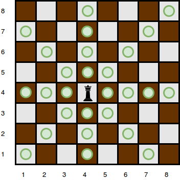

# Queen-s-Attack-

 code using all different conditions in different loop 

 initially we are storing the position of obstacle in the map of pair and value ,  means if obstacle is at position 4,2 then
  map[4][2] becomes 1  means here we got a obstacle if 0 then queen is free to move.

 
  

After it we comes on the conditions 

  
 first conditon is when queen goes in ways top left 

  
 second conditon is when queen goes in ways top 

  
 three conditon is when queen goes in ways top right 

  
 four conditon is when queen goes in ways right 

  
 five conditon is when queen goes in ways bottom right 

  
 six conditon is when queen goes in ways bottom 

  
 seven conditon is when queen goes in ways bottom left 

  
 eight conditon is when queen goes in ways left 

